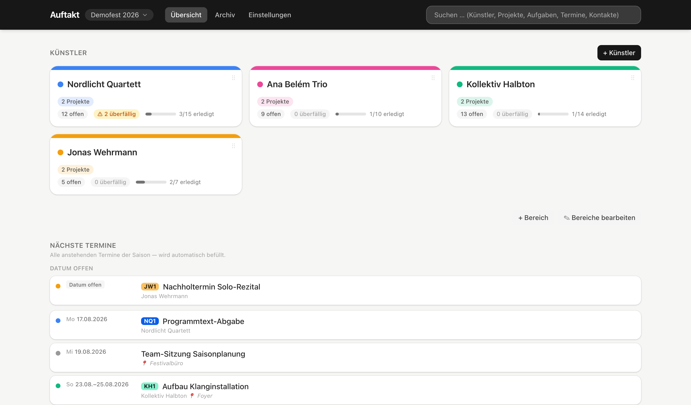

<p align="center">
  
</p>

<h1 align="center">Auftakt</h1>

<p align="center">
  Lokale Desktop-App für die Künstler- und Projektverwaltung<br>
  Alle Daten bleiben auf dem eigenen Rechner.
</p>

<p align="center">
  <a href="https://github.com/andrewendlinger/auftakt/releases/latest"><strong>→ Auftakt herunterladen</strong></a>
</p>

<p align="center">
  
</p>

## Was Auftakt ist

Auftakt hält an einer Stelle zusammen, was sonst auf Tabellen, Mail-Ordner und Notizzettel
verteilt liegt:

- **Künstler** mit Notizen, Kontakten und einem Ein-Pager zum Ausdrucken (PDF)
- **Projekte** je Künstler — Konzert, Workshop, Aufnahme — jedes mit eigenem Stand
- **Termine**: Auftritte, Proben, Deadlines; ganztägig oder mit Uhrzeit
- **Aufgaben** mit Unteraufgaben, Fälligkeiten, Farben und selbst angelegten Spalten
- **Kontakte, Dokumente & Links** dort, wo man sie sucht — am Künstler, am Projekt, an der Saison
- **Eine Saison = eine Datenbank.** Mehrere Saisons nebeneinander, jede in ihrem eigenen Fenster

Auftakt läuft **offline**. Es gibt kein Konto, keine Cloud und keinen Server: Die Daten liegen als
Datei auf dem Rechner und werden nirgendwohin übertragen. Die einzige Verbindung nach außen ist
die Frage „gibt es eine neuere Version?".

## Installation

Die fertigen Installationsdateien liegen auf der
**[Releases-Seite](https://github.com/andrewendlinger/auftakt/releases/latest)**:

| System | Datei | Größe |
| --- | --- | --- |
| macOS (Apple Silicon) | `Auftakt-<Version>-arm64.dmg` | ~120 MB |
| Windows (64-Bit) | `Auftakt-Setup-<Version>.exe` | ~100 MB |

Für Linux und für Intel-Macs gibt es keine Version.

### macOS

Voraussetzung: **macOS 12 oder neuer**, Mac mit **Apple Silicon** (M1, M2, M3, M4).

1. `Auftakt-<Version>-arm64.dmg` herunterladen und per Doppelklick öffnen.
2. **Auftakt** in den Ordner **Programme** ziehen.
3. Einmalig im Terminal (Programme → Dienstprogramme → Terminal) ausführen:

   ```bash
   xattr -dr com.apple.quarantine /Applications/Auftakt.app
   ```

4. Auftakt starten.

**Warum dieser Schritt?** Ohne ihn meldet macOS „Auftakt.app ist beschädigt und kann nicht
geöffnet werden". Die App ist **nicht** beschädigt: Sie ist nicht bei Apple signiert und
notarisiert — dafür wäre ein kostenpflichtiger Apple-Developer-Account nötig. macOS versieht
heruntergeladene, unsignierte Programme mit einem Quarantäne-Flag, und der Befehl entfernt genau
dieses Flag. Je nach macOS-Version funktioniert auch ein Rechtsklick auf die App → **Öffnen**;
verlässlich ist der Terminal-Befehl.

### Windows

Voraussetzung: **Windows 10 oder 11**, 64-Bit.

1. `Auftakt-Setup-<Version>.exe` herunterladen und ausführen.
2. Windows meldet **„Der Computer wurde durch Windows geschützt"** → auf **„Weitere
   Informationen"** klicken, dann auf **„Trotzdem ausführen"**.
3. Dem Installationsdialog folgen. Der Zielordner lässt sich ändern, und
   **Administratorrechte sind nicht nötig** — installiert wird für den angemeldeten Benutzer.

**Warum diese Warnung?** Der Installer trägt keine Windows-Code-Signatur (ein Zertifikat dafür
kostet jährlich Geld). SmartScreen kennt den Herausgeber deshalb nicht und warnt, wie bei jedem
unbekannten Programm.

### Ist der Download echt?

Beide Installationsdateien werden von GitHub Actions aus dem hier veröffentlichten Quellcode
gebaut und tragen seit v0.5.0 eine Build-Provenance-Attestierung — einen Nachweis, aus welchem
Commit und welchem Build-Lauf die Datei stammt. Prüfen lässt sie sich mit der
[GitHub CLI](https://cli.github.com):

```bash
gh attestation verify Auftakt-*.dmg --repo andrewendlinger/auftakt
```

Was das ersetzt und was nicht, steht in [SECURITY.md](SECURITY.md).

## Erste Schritte in der App

Beim ersten Start ist Auftakt leer. Einen Einrichtungsassistenten gibt es nicht, weil es nichts
einzurichten gibt:

1. Eine erste Saison **„Festival 2026"** ist bereits angelegt. Umbenennen und weitere Saisons
   anlegen: **Einstellungen → „Saison & Daten"**. **⌘N** (macOS) bzw. **Strg+N** (Windows) öffnet
   ein weiteres Fenster — jedes Fenster kann eine andere Saison zeigen.
2. **„+ Künstler"** auf der Übersicht legt den ersten Eintrag an. Projekte, Termine, Aufgaben,
   Kontakte und Links hängen daran.
3. Sobald die ersten Daten drin sind, fragt Auftakt beim **nächsten** Start: „Automatische
   Sicherungen einrichten?" Dort einen Ordner wählen — z. B. in Google Drive oder OneDrive. Die
   Frage kommt bei jedem Start wieder, bis ein Ordner gewählt ist.
4. Eine vorhandene Datenbank übernehmen: **Datei → Datenbank importieren…**

Gut zu wissen:

- Die **Suche** oben rechts findet Künstler, Projekte, Aufgaben, Termine und Kontakte.
- **„Ein-Pager (PDF)"** druckt eine Künstler- oder Projektseite auf ein Blatt; **„⬇ Excel"**
  exportiert die Aufgabenliste.
- **„Bereiche bearbeiten"** baut jede Seite um: Abschnitte verschieben, ausblenden, hinzufügen.
  Überschriften lassen sich per **✎** umbenennen.
- Das **Archiv** hält erledigte Aufgaben und den Papierkorb.

## Deine Daten

- **Wo sie liegen:** macOS `~/Library/Application Support/auftakt`, Windows `%APPDATA%\auftakt`
  — je Saison eine `.db`-Datei.
- **Nicht in einen Cloud-Ordner legen.** Eine laufende Datenbank verträgt keinen Sync-Dienst, der
  Dateien im Hintergrund austauscht. Für die *Sicherungen* ist ein Cloud-Ordner dagegen genau
  richtig.
- **Sicherungen:** Bei jedem Start legt Auftakt eine datierte Kopie jeder Saison im gewählten
  Ordner ab und behält die letzten 30. Im Sicherungsordner liegt eine Anleitung zum Zurückspielen.
- **Papierkorb statt Löschen:** Gelöschtes lässt sich sofort rückgängig machen und liegt danach
  30 Tage im Papierkorb.
- **Erledigte Aufgaben** rutschen nach unten und wandern 30 Tage nach Abschluss ins Archiv.

## Updates

- **Windows:** **Einstellungen → „Programm & Hilfe" → „Version & Updates"**, dort „Nach Updates
  suchen" und dann „Herunterladen & installieren". Die App startet dafür neu.
- **macOS:** Auftakt meldet nur, dass es eine neue Version gibt — automatische Updates brauchen
  eine Apple-Signatur. Also die neue `.dmg` von der Releases-Seite laden, Auftakt in „Programme"
  ersetzen und den `xattr`-Befehl von oben erneut ausführen.
- **Die Daten bleiben bei einem Update erhalten.**

## Was noch nicht drin ist

- Kein Kalender-Sync und kein `.ics`-Export (die Termine sind dafür vorbereitet)
- Kein Mehrbenutzerbetrieb — Auftakt ist eine Einzelplatz-App
- Kein Linux-Build, kein Intel-Mac-Build

## Hilfe & Fehler melden

Am einfachsten aus der App heraus: **Einstellungen → „Programm & Hilfe" → „Feedback senden…"**.
Der Dialog fragt zuerst, ob es um einen **Fehler** oder einen **Wunsch** geht, und stellt danach
die passenden Fragen. Er legt Version und System bei und öffnet damit dein E-Mail-Programm — du
siehst vorher, was drinsteht. Jede Meldung bekommt eine Kennung wie `AF-2608141542`, die im Betreff
steht; darauf lässt sich später Bezug nehmen.

Bei einem **Fehler** legt Auftakt zusätzlich einen Diagnosebericht auf dem Schreibtisch ab —
`Auftakt-Diagnose-<Kennung>.txt`, mit dem vollständigen Startprotokoll, den zuletzt aufgetretenen
Fehlern und den Angaben zum Rechner.
Der Dialog sagt vorher, dass das passiert, und die E-Mail beginnt mit der Bitte, die Datei
anzuhängen. **Anhängen musst du sie selbst** — eine E-Mail lässt sich von außen nicht mit einem
Anhang öffnen, das kann kein Programm für dich übernehmen. Die Datei ist reiner Text, enthält keine
Termine, Künstler oder Kontakte, und du kannst sie vorher in Ruhe durchlesen.

Fehlerberichte und Ideen sind ebenso willkommen als
[Issue](https://github.com/andrewendlinger/auftakt/issues). Hilfreich sind: was du getan hast, was
du erwartet hast, was stattdessen passiert ist, dazu die Version (Einstellungen → „Programm &
Hilfe" → „Version & Updates") und dein Betriebssystem.

**Bitte keine echten Festivaldaten hineinkopieren** — keine Namen, Adressen, Telefonnummern oder
Notizen zu identifizierbaren Personen. Dieses Repository ist öffentlich.

Sicherheitsprobleme bitte nicht als Issue, sondern vertraulich über [SECURITY.md](SECURITY.md).

## Lizenz

[PolyForm Strict License 1.0.0](LICENSE.md) — der Quellcode ist einsehbar, und die App darf für
nichtkommerzielle Zwecke genutzt werden (privat, Hobby, sowie gemeinnützige, Bildungs- und
öffentliche Einrichtungen). Weitergabe und Veränderung sind nicht gestattet.

**Kommerzielle bzw. betriebliche Nutzung ist damit nicht abgedeckt.** Für eine kommerzielle
Lizenz bitte melden — siehe [LICENSE.md](LICENSE.md).

## Für Entwickler

Der Quellcode ist einsehbar, aber nicht frei veränderbar (siehe Lizenz). Pull Requests werden
deshalb nicht angenommen — Issues dagegen gern.

| Datei | Inhalt |
| --- | --- |
| [`CONTRIBUTING.md`](CONTRIBUTING.md) | lokal starten, Stack, Repository-Aufbau, Prüf-Gates, Installer bauen, Commit-Konvention |
| [`docs/ARCHITECTURE.md`](docs/ARCHITECTURE.md) | die drei Schichten, Zeitstempel-Konvention, Saisons, Backups, Soft-Delete, Spalten-Modell, Client-Verträge |
| [`docs/DECISIONS.md`](docs/DECISIONS.md) | bewusst *nicht* umgesetzte Dinge, mit Begründung |
| [`docs/VERIFYING.md`](docs/VERIFYING.md) | Fallstricke beim Prüfen im Browser |
| [`docs/BACKUP-TESTING.md`](docs/BACKUP-TESTING.md) | manuelle Backup-/Import-Checkliste vor jedem Release |
| [`SECURITY.md`](SECURITY.md) | Meldeweg, Signierung, Download-Verifikation |
